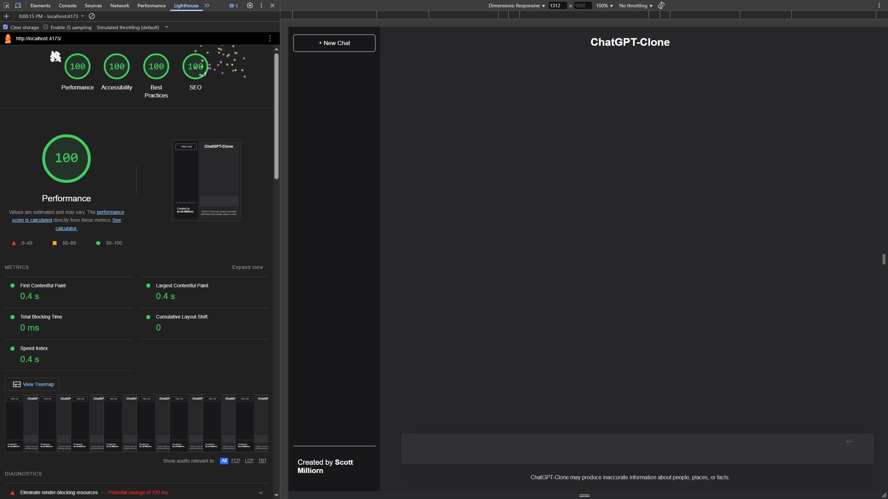

# ChatGPT Clone

## Description

This repository contains a ChatGPT clone project that allows you to run an AI-powered chatbot locally. The project is built on the GPT-3.5 architecture, providing a simple and customizable implementation for developing conversational AI applications.

## Preview

## Features

- AI-powered chatbot powered by OpenAI's GPT-3.5 model.
- Local deployment to run the chatbot on your machine.
- Customizable conversation handling and input/output formatting.
- Extensible architecture for adding additional functionality.

## Installation

To get started with the ChatGPT clone, follow these steps:

1. Clone the repository:
   git clone <https://github.com/milliorn/chatgpt-clone.git>

2. Install the dependencies:
   cd chatgpt-clone
   npm install

## Usage

Set up your OpenAI API credentials by creating a `.env` file in the project's root directory and adding your API key:
   OPENAI_API_KEY=<your_key_goes_here>

1. Start the chatbot server:
   npm run dev:backend

2. Start the frontend development server:
   npm run dev:frontend

Access the chatbot in your web browser at [http://localhost:3000](http://localhost:3000)

## Configuration

Contributions are welcome! If you encounter any issues or have suggestions for improvements, please feel free to create an issue or submit a pull request.
